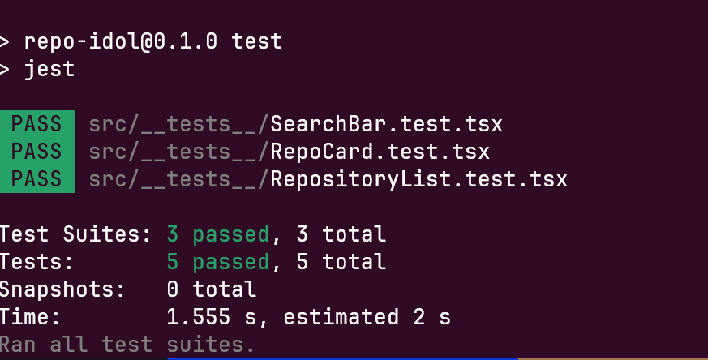
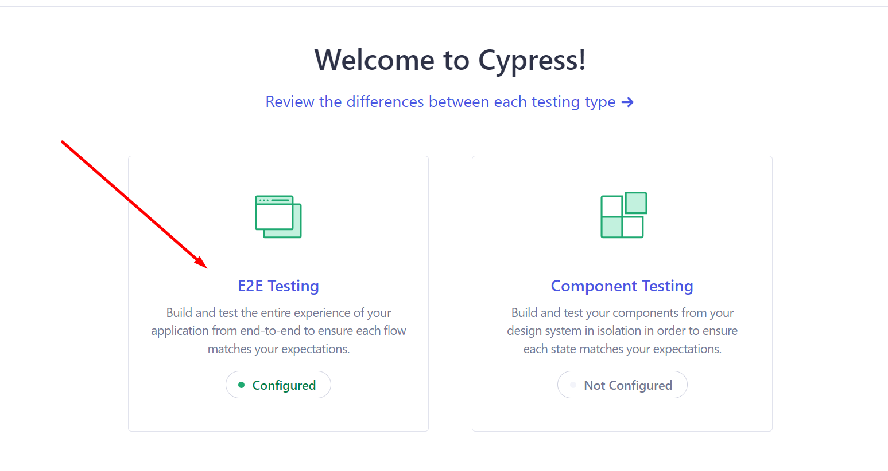
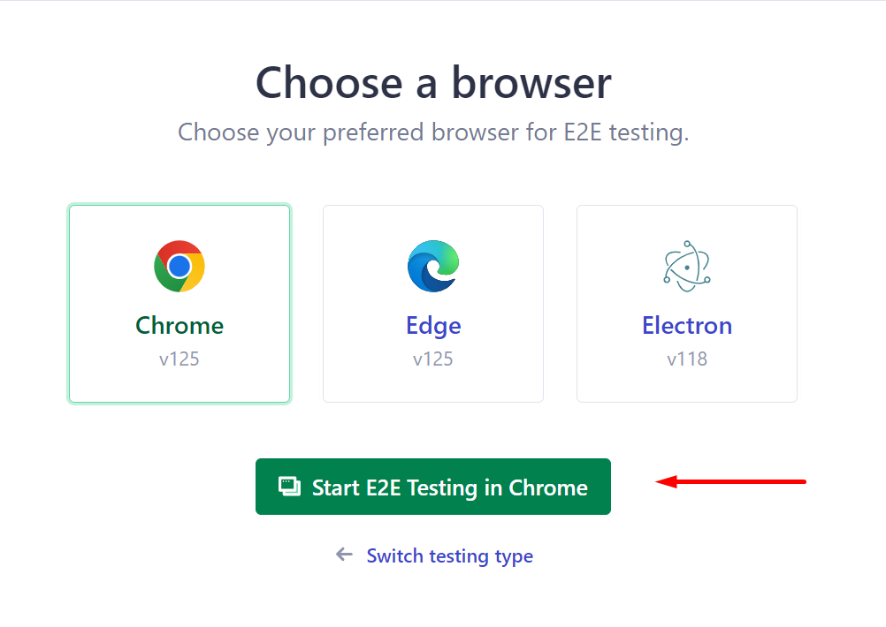
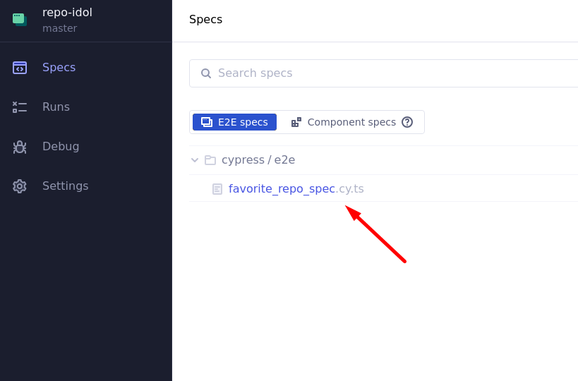
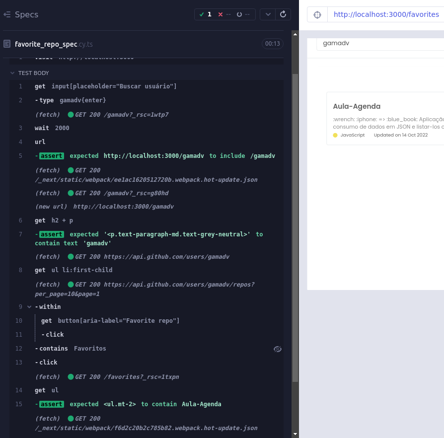

# Github Search

Uma aplicação web que permite aos usuários buscar informações sobre usuários do GitHub e listar todos os repositórios associados a eles. Os usuários podem marcar repositórios como favoritos para fácil acesso posterior.

## ⚒️ Funcionalidades

- **Busca de Usuário**: Pesquise por um usuário do GitHub e visualize seus repositórios. (Funciona ao digitar e clicar ENTER ou clicando no botão de pesquisa no campo)
- **Lista de Repositórios**: Exiba todos os repositórios do usuário pesquisado.
- **Favoritar Repositórios**: Marque repositórios como favoritos para acessá-los rapidamente na página de favoritos.

## 📑 Páginas

- **Home**: Página inicial com uma barra de busca para encontrar usuários.
- **User Page**: Página do usuário exibindo informações do perfil e lista de repositórios.
- **Favorites Page**: Página listando todos os repositórios marcados como favoritos.

## Tecnologias Utilizadas


## 📐Configuração do Projeto

### Variáveis de Ambiente

Para executar o projeto, é necessário configurar uma variável de ambiente
`NEXT_PUBLIC_GITHUB_TOKEN`.
Esta variável deve conter um token gerado no perfil do GitHub.

Crie um arquivo `.env.local` baseado no `.env.example` e adicione seu token:

```sh
NEXT_PUBLIC_GITHUB_TOKEN=seu_token_aqui
```

<details>
  <summary>
      <strong>Gerando um Token (caso não tenha)</strong>
  </summary>

- Vá para GitHub Settings: https://github.com/settings/tokens
- Clique em Generate new token.
- Adicione uma descrição e selecione as permissões desejadas.
- Clique em Generate token.
- Copie o token gerado e adicione ao arquivo .env

</details>

## ⚙️ Instalação e Execução

### Requisitos

- Node.js >= 14
- npm >= 6

1. Clone Repo

```bash
git clone https://github.com/lancaluis/github-search.git
cd github-search
```

2. Instalar Deps

```bash
npm i
```

3. Configure as variáveis de ambiente:

```bash
cp .env.example .env.local
# Adicione seu token ao arquivo .env.local
```

4. Execute o projeto:

```bash
npm run dev
```

Scripts Disponíveis

- `dev`: Executa a aplicação em modo de desenvolvimento.
- `build`: Cria a build de produção.
- `start`: Inicia a aplicação em modo de produção.
- `lint`: Executa o linting no código.
- `test`: Executa os testes unitários.
- `test:watch`: Executa os testes unitários em modo watch.
- `test:cy`: Abre o Cypress para testes E2E.

## 🧪 Testes

Nos testes unitários, basta rodar

```bash
npm run test
#ou
npm run test:watch
```


No E2E foi utilizado Cypress para melhor validação do fluxo principal.
`Procurar usuário > Escolher Repo > Favoritar > Checar página de Favoritos`.
Basta rodar o projeto em conjunto com outro terminal com:

```bash
  $ npm run test:cy
```

Abrirá a GUI do Cypress, basta seguir esse caminho:

`E2E Testing > Start E2E in (Browser de preferência) > Arquivo com testes: "favorite_repo_spec.cy.ts`

</details>
<details>
  <summary>
      <strong>Passo a Passo em imagens</strong>
  </summary>
  
  
  

</details>
<br />

Após isso ele abrirá e executará os testes que estão na pasta `cypress/e2e`



## Deploy

O site foi deployado usando **Vercel**. Você pode acessá-lo [aqui](https://repo-idol.vercel.app/).
